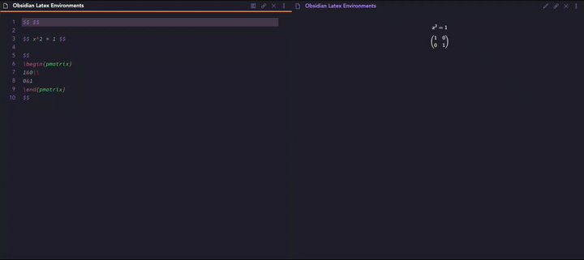

# obsidian-latex-environments

> Quickly insert and change latex environments within math blocks in Obsidian.

## Installation

If you have Obsidian version 0.9.8 or greater:

1. Open the options pane
1. Go to `Third-party plugins`
1. Ensure that `safe-mode` is *off*. (**WARNING: Please verify for yourself the safety of any plugins before using them.**)
1. Click `Browse` next to Community Plugins
1. Search for `Latex Environments`
1. Click `Install`
1. Go back to the `Third-party plugins` page and enable `Latex Environments`

To update simply go back to the `Third-Party plugins` page for `Latex Environments` and click `Update`.

### Manual Installation
To manually install
 1. download the latest `zip`from the [latest Github Release](https://github.com/raineszm/obsidian-latex-environments/releases/latest)
 1. unzip the contents into the `.plugins/obsidian-latex-environments` subdirectory of your vault.
 1. reload obsidian
 1. go into settings > third party plugins and activate obsidian-latex-environments

For details see [the forums](https://forum.obsidian.md/t/plugins-mini-faq/7737).

## Usage

###  Commands

This plugin currently provides 3 commands, which do not have default bindings.
Both commands only work when the cursor is inside a math block.
Both commands will also query for the name of the environment.

#### Insert Environment

Insert a new LaTeX environment at the cursor.

**With a selection** inserts a new LaTeX environment around the selection.

#### Change Environment

Change the name of the surrounding LaTeX environment.

*If the cursor is on a `\begin` or `\end`, it is the corresponding environment that will be changed.*

### Delete Environment

Remove the innermost LaTeX environment enclosing the cursor.

## Contributing
Pull requests are welcome. For major changes, please open an issue first to discuss what you would like to change.

Please make sure to update tests as appropriate.

## License
[MIT](https://choosealicense.com/licenses/mit/)

